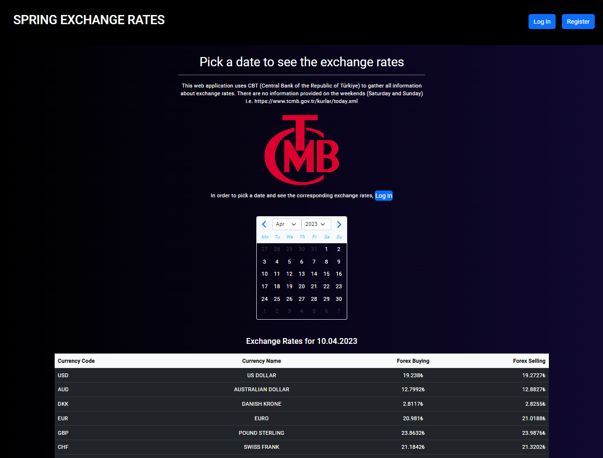
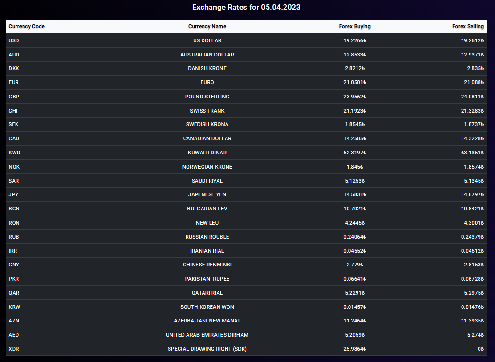
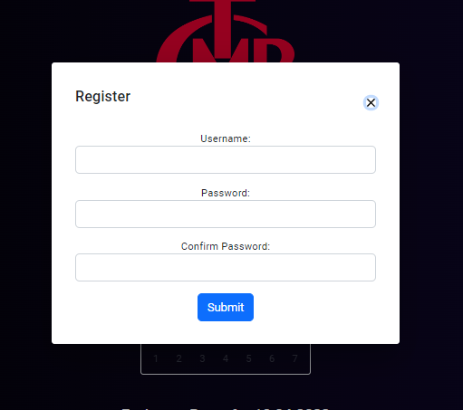
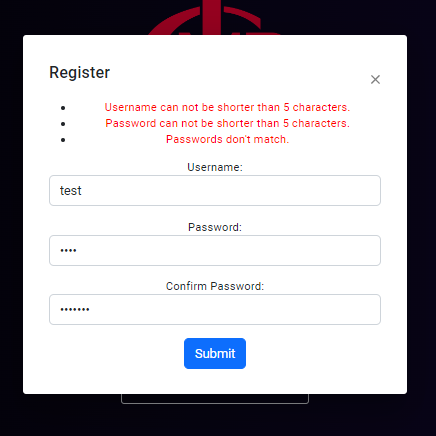
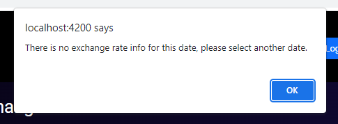

CurrenyApp
================

General Info
------------
> Currency App is a fullstack web application used to retrieve exchange rate info from TCMB. 
> Using: Angular, RestAPI, Spring Boot, JPA, PostgreSQL

### Features
* POST and GET requests for -Login, Register-
* See exchange rates data from TCMB for any date selected
* SQL Database system using PostgreSQL, JPA
* Responsive Design for both Web and Mobile

### Installation
- Refer to the Backend repository of this app to get the backend running. https://github.com/Burakcoli/SpringCurrency
- NodeJS and angular-cli to be installed.
- Open VS code with corresponding downloaded folder
- In VS code open Integrated command prompt/terminal
- run npm install command
- run ng serve command
- On your browser go to the url: http://localhost:4200

### Screenshots

> Home Page    
> Exchange Rates     
> Register     
> Register Validation    
> Error on Unavailable Days    
